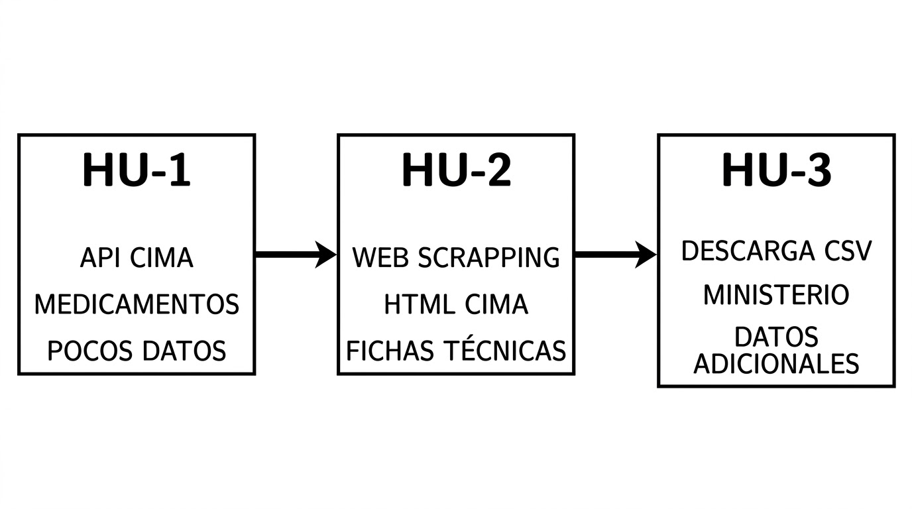

# Data Engineering Project

27 de Septiembre de 2026.

Integrantes: Gonzalo Carrasco, Rafael Sánchez Largo, Santiago Lillo Macías.

Para obtener el resultado global de toda la práctica, debe ejecutarse el archivo `orquestador.py`, dentro de `src/proyecto_ingenieria_dato`. Esto va a crear un archivo `catalogo_enriquecido.xlsx` con los datos finales.

## Objetivo

Automatizar la obtención de datos sobre cierto tipo de medicamentos. En nuestro caso queremos recolectar datos de medicamentos para combatir la migraña.

## Descripción del problema

- HU-1: obtener medicamentos para la migraña del CIMA mediante su API. 
- HU-2: inspeccionar las fichas técnicas de los medicamentos mediante web scraping. De aquí sacamos 
conclusiones numéricas que añadimos en nuevas columnas. 
- HU-3: Añadimos datos del Ministerio como Precio, si es o no un tratamiento de larga duración, ... 
para cada medicamento. También añadiremos esto como columnas. 

### Data generated

Al ejecutar `orquestador.py`, se crean 4 archivos de datos: 

- `medicamentos_raw.json` y `medicamentos.xlsx` pertenece a HU-1 
- `medicamentos_web_scrapping.xlsx` pertenece a HU-2 
- `catalogo_enriquecido.xlsx` pertenece a HU-3 

En realidad es el “mismo” archivo, pero vamos añadiendo columnas según obtenemos más información, hasta llegar al xlsx final, `catalogo_enriquecido`.