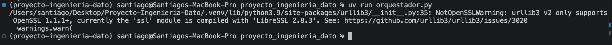
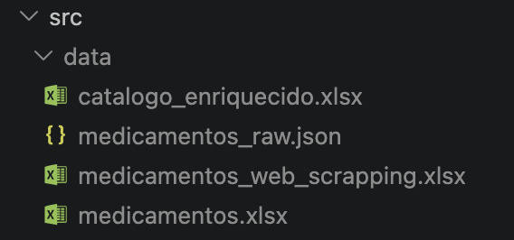
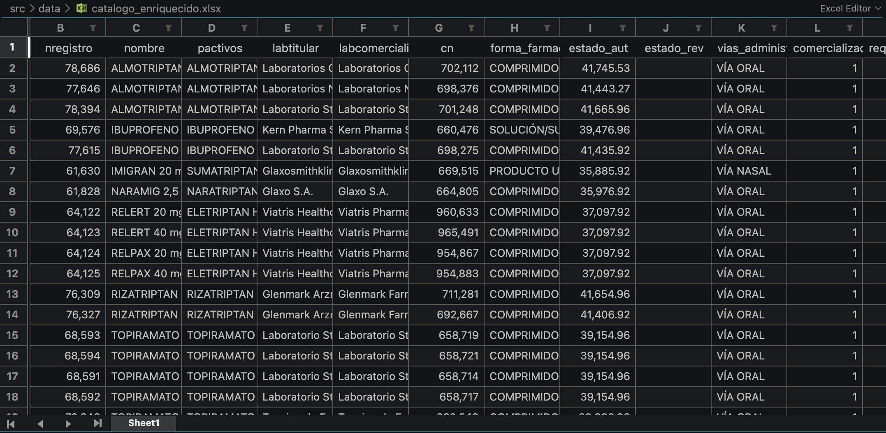

# Proyecto de ingeniería del dato

27 de Septiembre de 2026.

Integrantes: Gonzalo Carrasco, Rafael Sánchez Largo, Santiago Lillo Macías.

Para obtener el resultado global de toda la práctica, debe ejecutarse el archivo `orquestador.py`, dentro de `src/proyecto_ingenieria_dato`. Esto va a crear un archivo `catalogo_enriquecido.xlsx` con los datos finales.

En la redacción del README no han sido utilizadas herramientas de IA.

## Enfermedad
Migraña

## Memoria
En este README se van a responder a las preguntas proporcionadas en la plantilla _Sprint_ del campus virtual.

## Introducción

EL objetivo de este trabajo es obtener unos datos concretos sobre los medicamentos para combatir una determinada enfermedad, que en nuestro caso es la migraña. 

### ¿Cómo lo hacemos?

A través de diferentes métodos, como peticiones a APIs o web-scraping.

### ¿Por qué es importante este tipo de problema?

Porque en muchas ocasiones necesitamos hacer __Data Extraction__. En este caso, tenemos los datos (CIMA, ministerio, ...), pero "desperdigados". Es decir, debemos obtenerlos de varias fuentes, depurarlos, y unificarlos en un archivo `.xlsx` final.

## Metodología

### Herramientas utilizadas

- IDE: VS Code
- Lenguaje: Python
- Bibliotecas: requests, json, pathlib, pandas, re, BeautifulSoup

### Pruebas realizadas

Para realizar pequeñas pruebas y verificar el funcionamiento de los scripts, nos hemos apoyado en el uso de jupyter notebooks, de manera que podíamos comprobar cada data extraction con pequeños ejemplos, como puede ser un solo medicamento.

### Resultados

Al ejecutar este comando

Se crean 4 archivos de datos

Una visualización parcial de `catalogo_enriquecido.xlsx` es la siguiente

### Discusión

Los resultados finalmente han sido los esperados. Sin embargo, sí hubo algún conflicto al inicio del proyecto. Por ejemplo, al inspeccionar el dataframe y acceder a sus datos de manera equivocada, lo cual se solucionó accediendo a la documentación de librerías como pandas.

## Conclusión

Este trabajo va a ser vital tanto en la asignatura como en el máster, debido a su posibilidad de generalización a cualquier otro caso (no solamente medicamentos) y de automatización de la recogida de datos en cualquier proyecto de otras asignaturas (y por supuesto en el mundo profesional). Naturalmente, habrá veces en las que no podremos obtener los datos deseados únicamente con este método. No obstante, esto supone una herramienta nueva para la extracción de los mismos. Esperamos aprender nuevos métodos en todo el ciclo ETL/ELT.